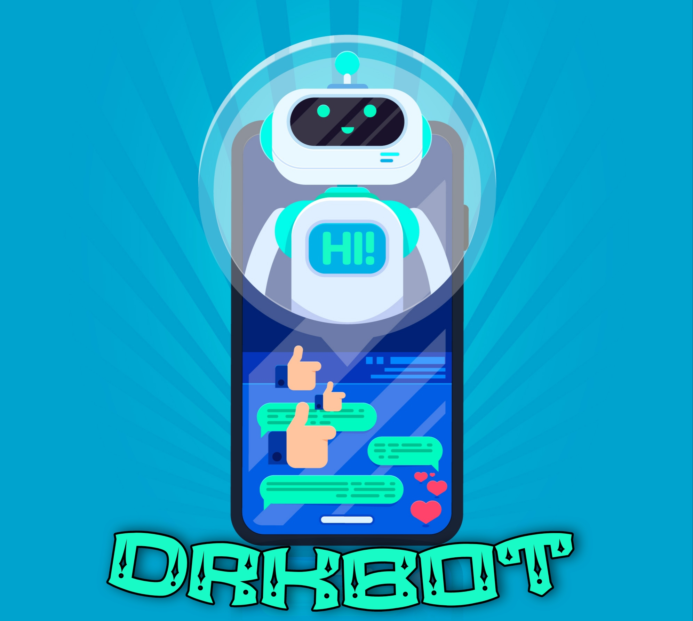

## DrkBot Rest-Api

<p align="center">
  <a href="https://github.com/botpage/drkbot-rest/fork">
    
  </a>
  <a href="https://github.com/DrkBotBase/stargazers">
    
  </a>
  <a href="https://github.com/botpage/drkbot-rest/commits/master">
    
  </a>
</p>

<p align="center">
  <a href="httsp://github.com/botpage/drkbot-rest">
    

  </a>
  <a href="https://github.com/botpage/drkbot-rest/blob/master/LICENSE">
    

  </a>
  <a href="https://github.com/botpage/drkbot-rest">
    

  </a>
  <a href="https://github.com/ianvanh">
    

  </a>
  <a href="https://t.me/Dark1522">
    

  </a>
</p>

```
DrkBot Rest-Api es una Rest de código abierto.
El usuario es responsable de todas las consecuencias que pudieran derivarse de un uso incorrecto o indebido.
Dado que es un proyecto de código abierto, cualquiera puede copiar el software, editarlo y usarlo de forma personalizada.

El uso es responsabilidad del usuario, así como el sistema operativo no es responsable
por el trabajo realizado con los programas que se instalan posteriormente, DrkBot Rest-Api
no es responsable del propósito y método de uso de los usuarios.


DrkBot Rest-Api it is open source software.
The user is responsible for all consequences that may arise from incorrect or improper use.
Since it is an open source project, anyone can copy the software, edit it and use it in a custom way.

The use is the responsibility of the user, as well as the operating system is not responsible
for the work done with the programs that are installed later, DrkBot Rest-Api
is not responsible for the purpose and method of use of users.
```

<div align="center">
  
  <h1>☢️ DrkBot Rest-Api ☢️</h1>
</div>
<p align="center">
    <br>
      | <a href="https://t.me/Dark1522">Telegram Channel</a> |
        <a href="http://wa.me/573046793853?text=/alive">BOT WhatsApp</a> |
        <a href="https://chat.whatsapp.com/IeRNuoNY1IQJS8JE02duW8">Grupo de Soprte</a> |
    <br>
</p>

----

## Developers

[](#) |
----|
[Ian Vanh](https://t.me/Dark1522) |
Developer, Bug Fixes |

## License
This project is protected by `GNU AFFERO GENERAL PUBLIC LICENSE v3` license.